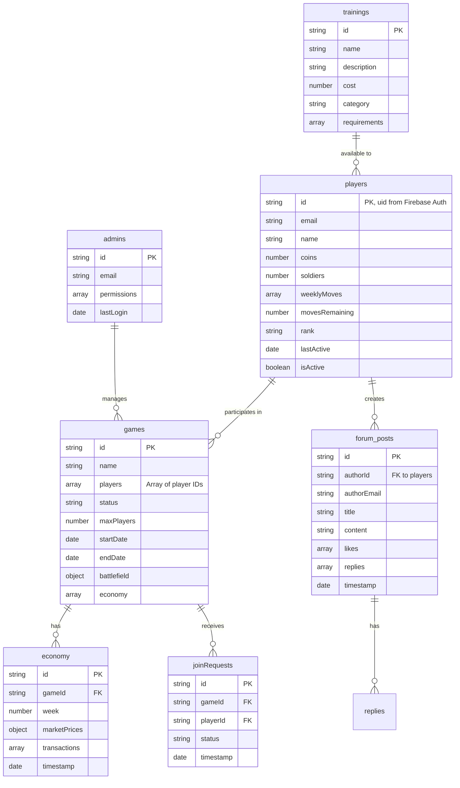

# Soldiers of Wealth Database Schema

## Complete Schema Overview



## Detailed Field Specifications

### Players Collection
- `id`: string (Primary Key, matches Firebase Auth UID)
  - Indexed for quick user lookup
- `email`: string (unique)
  - Indexed for authentication
- `name`: string
  - Commander display name
- `coins`: number
  - Default: 1000
  - Min: 0
- `soldiers`: number
  - Default: 100
  - Min: 0
- `weeklyMoves`: array
  - Tracks moves made in current week
  - Limited to 3 per week
- `movesRemaining`: number
  - Range: 0-3
  - Resets weekly
- `rank`: string
  - Enum: ['Recruit', 'Sergeant', 'Captain', 'Major', 'Colonel', 'General']
- `lastActive`: timestamp
- `isActive`: boolean

### Games Collection
- `id`: string (Primary Key)
  - Auto-generated
- `name`: string
  - Unique game identifier
- `players`: array
  - Contains player IDs
  - Max length based on maxPlayers
- `status`: string
  - Enum: ['pending', 'active', 'completed']
- `maxPlayers`: number
  - Range: 2-12
- `startDate`: timestamp
- `endDate`: timestamp
- `battlefield`: object
  - Complex nested structure for game state
- `economy`: array
  - References to economy documents

### Economy Collection
- `id`: string (Primary Key)
- `gameId`: string (Foreign Key)
  - Indexed for game lookup
- `week`: number
  - Indexed for chronological queries
- `marketPrices`: object
  - Dynamic pricing data
- `transactions`: array
  - Historical market activity
- `timestamp`: timestamp

### Forum Posts Collection
- `id`: string (Primary Key)
- `authorId`: string (Foreign Key)
  - References players collection
- `authorEmail`: string
- `title`: string
  - Max length: 100 chars
- `content`: string
  - Max length: 2000 chars
- `likes`: array
  - Contains player IDs
- `replies`: array
  - Nested comments structure
- `timestamp`: timestamp
  - Indexed for chronological display

### Join Requests Collection
- `id`: string (Primary Key)
- `gameId`: string (Foreign Key)
  - Indexed for game lookup
- `playerId`: string (Foreign Key)
  - References players collection
- `status`: string
  - Enum: ['pending', 'accepted', 'rejected']
- `timestamp`: timestamp

### Admins Collection
- `id`: string (Primary Key)
- `email`: string (unique)
  - Indexed for authentication
- `permissions`: array
  - Contains permission strings
- `lastLogin`: timestamp

### Trainings Collection
- `id`: string (Primary Key)
- `name`: string (unique)
- `description`: string
- `cost`: number
  - Min: 0
- `category`: string
  - Enum: ['combat', 'economy', 'intelligence']
- `requirements`: array
  - Prerequisite training IDs

## User Management Structure

### Authentication
- Uses Firebase Authentication
- Email/Password authentication
- Custom claims for admin roles
- Session persistence configurable
- Token-based authentication

### Roles and Permissions
1. **Players (Default)**
   - Access own profile
   - Participate in games
   - Post in forums
   - Make market transactions

2. **Admins**
   - Manage players
   - Create/modify games
   - Moderate forums
   - Manage economy

### Security Rules
```javascript
rules_version = '2';
service cloud.firestore {
  match /databases/{database}/documents {
    // Player access
    match /players/{userId} {
      allow read: if request.auth != null;
      allow write: if request.auth.uid == userId;
    }
    
    // Game access
    match /games/{gameId} {
      allow read: if request.auth != null;
      allow write: if hasAdminRole();
    }
    
    // Forum access
    match /forum_posts/{postId} {
      allow read: if request.auth != null;
      allow create: if request.auth != null;
      allow update, delete: if request.auth.uid == resource.data.authorId || hasAdminRole();
    }
    
    // Admin only
    match /admins/{adminId} {
      allow read, write: if hasAdminRole();
    }
    
    // Helper functions
    function hasAdminRole() {
      return request.auth != null && 
        get(/databases/$(database)/documents/admins/$(request.auth.uid)).data != null;
    }
  }
}
```

## Core Entity Relationships

1. **Player-Game Relationship**
   - Many-to-Many relationship
   - Players can join multiple games
   - Games can have multiple players
   - Constrained by game.maxPlayers

2. **Game-Economy Relationship**
   - One-to-Many relationship
   - Each game has weekly economy records
   - Economy records belong to single game

3. **Player-Forum Relationship**
   - One-to-Many relationship
   - Players can create multiple posts
   - Posts belong to single author

4. **Game-JoinRequest Relationship**
   - One-to-Many relationship
   - Games can have multiple join requests
   - Requests belong to single game

## Performance Optimization

### Indexes
```javascript
// Single-field indexes
players.email
players.isActive
games.status
forum_posts.timestamp
economy.week

// Composite indexes
games_players_status: {
  collection: 'games',
  fields: ['players', 'status']
}

economy_gameId_week: {
  collection: 'economy',
  fields: ['gameId', 'week']
}

forum_timestamp_likes: {
  collection: 'forum_posts',
  fields: ['timestamp', 'likes']
}
```

### Query Optimization
1. Denormalization strategies:
   - Store authorEmail in forum_posts
   - Cache player counts in games
   - Maintain running totals for economy

2. Pagination implementation:
   - Forum posts: limit(20).orderBy('timestamp')
   - Game history: limit(10).orderBy('endDate')
   - Market transactions: limit(50).orderBy('timestamp')

### Security Rules Optimization
- Use composite indexes for complex queries
- Implement caching for frequently accessed data
- Batch writes for multiple document updates

## Example Data Structures

### Player Document
```json
{
  "id": "user123",
  "email": "commander@example.com",
  "name": "Commander Alpha",
  "coins": 1500,
  "soldiers": 250,
  "weeklyMoves": [
    {
      "type": "training",
      "timestamp": "2025-06-13T15:00:00Z"
    }
  ],
  "movesRemaining": 2,
  "rank": "Captain",
  "lastActive": "2025-06-13T16:00:00Z",
  "isActive": true
}
```

### Game Document
```json
{
  "id": "game456",
  "name": "Battle of Silicon Valley",
  "players": ["user123", "user456"],
  "status": "active",
  "maxPlayers": 8,
  "startDate": "2025-06-10T00:00:00Z",
  "endDate": "2025-07-10T00:00:00Z",
  "battlefield": {
    "tiles": [...],
    "resources": {...}
  },
  "economy": ["eco789", "eco790"]
}
```

### Forum Post Document
```json
{
  "id": "post789",
  "authorId": "user123",
  "authorEmail": "commander@example.com",
  "title": "Strategy Discussion",
  "content": "Here's my approach to the northern front...",
  "likes": ["user456", "user789"],
  "replies": [
    {
      "id": "reply001",
      "authorId": "user456",
      "content": "Great strategy!",
      "timestamp": "2025-06-13T16:05:00Z"
    }
  ],
  "timestamp": "2025-06-13T16:00:00Z"
}
```

## Migration Considerations

### Current to v2 Migration
1. Schema Updates
   - Add player ranking system
   - Expand economy tracking
   - Enhance battlefield mechanics

2. Data Migration Steps
   ```javascript
   // Example migration script
   async function migrateToV2() {
     // Add new fields to players
     const players = await db.collection('players').get();
     for (const player of players.docs) {
       await player.ref.update({
         rank: 'Recruit',
         movesRemaining: 3
       });
     }
     
     // Update game structure
     const games = await db.collection('games').get();
     for (const game of games.docs) {
       await game.ref.update({
         battlefield: {
           ...game.data().battlefield,
           version: 2,
           newFeatures: {}
         }
       });
     }
   }
   ```

### Future Considerations
1. Scalability
   - Implement sharding for large collections
   - Add support for multiple game modes
   - Enhance social features

2. Performance
   - Implement caching layer
   - Optimize query patterns
   - Add real-time features

3. Security
   - Enhanced role-based access
   - Rate limiting
   - Audit logging
