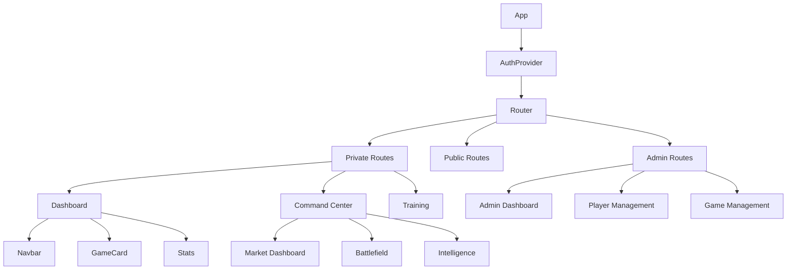
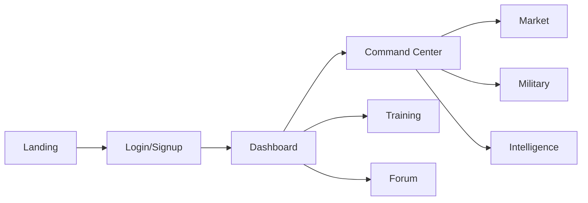

# Frontend Specification Document

## Screen Inventory

### 1. Authentication Screens
- **Login** (`/login`)
  ```javascript
  // Login.js
  const LoginContainer = styled.div`
    display: flex;
    flex-direction: column;
    align-items: center;
    justify-content: center;
    min-height: 100vh;
    background-color: #1E3D59;
    color: #D4AF37;
  `;
  ```
  - Email/password login
  - Google authentication
  - Password reset
  - Signup link

- **Signup** (`/signup`)
  - New user registration
  - Google signup
  - Initial player profile creation
  - Login link

### 2. Game Screens
- **Dashboard** (`/dashboard`)
  - Game overview
  - Player stats
  - Available actions
  - Notifications

- **Command Center** (`/game/:gameId`)
  - Market operations
  - Military actions
  - Intelligence board
  - Weekly moves

- **Training** (`/training`)
  - Training modules
  - Progress tracking
  - Module completion
  - Prerequisites system

### 3. Admin Screens
- **Admin Dashboard** (`/admin`)
  - Player management
  - Game management
  - Economy controls
  - Training administration

## Component Architecture



### Core Components

1. **Layout Components**
```javascript
// Modal.js
export default function Modal({ isOpen, onClose, title, children }) {
  return (
    <div className="fixed inset-0 z-50 overflow-y-auto">
      <div className="backdrop-blur-sm bg-black bg-opacity-50">
        <div className="bg-gray-900 rounded-lg">
          <div className="sticky top-0 flex items-center justify-between">
            <h2 className="text-xl font-bold military-header">{title}</h2>
            <button onClick={onClose}><FaTimes /></button>
          </div>
          <div className="p-6">{children}</div>
        </div>
      </div>
    </div>
  );
}
```

2. **Game Components**
```javascript
// GameLayout.js
const Container = styled.div`
  min-height: 100vh;
  background-color: #1E3D59;
  color: #D4AF37;
`;

const TabButton = styled.button`
  background: ${props => props.active ? '#4A5D23' : 'transparent'};
  color: #D4AF37;
  border: 2px solid ${props => props.active ? '#D4AF37' : 'transparent'};
`;
```

3. **Form Components**
```javascript
const Form = styled.form`
  background: rgba(0, 0, 0, 0.8);
  padding: 2rem;
  border-radius: 8px;
  width: 100%;
  max-width: 400px;
  border: 1px solid rgba(212, 175, 55, 0.2);
`;

const Input = styled.input`
  width: 100%;
  padding: 0.75rem;
  margin-bottom: 1rem;
  border: 1px solid #4A5D23;
  border-radius: 4px;
  background: rgba(0, 0, 0, 0.5);
  color: #D4AF37;
`;
```

## User Flow Analysis



### Key User Journeys

1. **New Player Onboarding**
   - Landing page
   - Signup
   - Tutorial
   - First game

2. **Game Participation**
   - Join game
   - Weekly actions
   - Market operations
   - Combat actions

3. **Training Progress**
   - Module selection
   - Content completion
   - Skill advancement
   - Achievement unlocks

## State Management

### 1. Authentication Context
```javascript
// AuthContext.js
export function AuthProvider({ children }) {
  const [currentUser, setCurrentUser] = useState(null);
  const [loading, setLoading] = useState(true);

  const value = {
    currentUser,
    signup,
    login,
    loginWithGoogle,
    logout
  };

  return (
    <AuthContext.Provider value={value}>
      {!loading && children}
    </AuthContext.Provider>
  );
}
```

### 2. Economic Context
```javascript
// EconomicContext.js
const economicState = {
  markets: {
    stocks: { risk: 'High', sensitivity: 'High' },
    realEstate: { risk: 'Medium', sensitivity: 'Low' },
    crypto: { risk: 'Very High', sensitivity: 'Extreme' }
  }
};
```

### 3. Game State
```javascript
const gameState = {
  currentWeek: 1,
  totalWeeks: 4,
  actionsRemaining: 3,
  soldiers: 100,
  wealth: 1000
};
```

## Design System

### Colors
```css
:root {
  --military-green: #4A5D23;
  --gold: #D4AF37;
  --dark-blue: #1a2639;
  --red: #C1292E;
}
```

### Typography
```css
.military-header {
  font-family: 'Black Ops One', cursive;
  letter-spacing: 0.05em;
}

body {
  font-family: 'Inter', -apple-system, BlinkMacSystemFont, sans-serif;
}
```

### Component Styles
```css
/* Buttons */
.button-finance {
  background: rgba(74, 93, 35, 0.2);
  border: 1px solid var(--military-green);
}

.button-attack {
  background: rgba(193, 41, 46, 0.2);
  border: 1px solid var(--red);
}

/* Cards */
.game-card {
  background: rgba(26, 38, 57, 0.5);
  border: 1px solid var(--military-green);
}

/* Battlefield */
.battlefield-tile {
  background-color: rgba(44, 62, 80, 0.5);
  border: 1px solid var(--military-green);
}
```

## Responsive Design

### Mobile First Approach
```javascript
// Responsive navigation
const ResponsiveNavbar = () => {
  const [isOpen, setIsOpen] = useState(false);
  
  return (
    <nav className="bg-gray-800 px-4 sm:px-6 py-4">
      <div className="flex justify-between items-center">
        <div className="block sm:hidden">
          <button onClick={() => setIsOpen(!isOpen)}>
            <FaBars />
          </button>
        </div>
        <div className={`${isOpen ? 'block' : 'hidden'} sm:block`}>
          {/* Navigation items */}
        </div>
      </div>
    </nav>
  );
};
```

### Grid Systems
```css
.battlefield-grid {
  display: grid;
  grid-template-columns: repeat(auto-fit, minmax(250px, 1fr));
  gap: 1rem;
  padding: 1rem;
}

@media (min-width: 768px) {
  .battlefield-grid {
    grid-template-columns: repeat(5, 1fr);
  }
}
```

## Performance Optimization

### Code Splitting
```javascript
// App.js - Route-based code splitting
const Dashboard = lazy(() => import('./components/dashboard/Dashboard'));
const CommandCenter = lazy(() => import('./components/game/CommandCenter'));
const Training = lazy(() => import('./components/training/Training'));
```

### Lazy Loading
```javascript
// Image lazy loading

```

### Caching Strategy
```javascript
// Firebase caching
const cacheConfig = {
  training: {
    maxAge: 3600,
    strategy: 'stale-while-revalidate'
  },
  gameData: {
    maxAge: 300,
    strategy: 'network-first'
  }
};
```

## Accessibility

### ARIA Labels
```javascript
// Accessible buttons
<button
  aria-label="Close modal"
  onClick={onClose}
  className="text-gray-400 hover:text-white"
>
  <FaTimes />
</button>
```

### Keyboard Navigation
```javascript
// Focusable elements
const Input = styled.input`
  &:focus {
    outline: none;
    border-color: #D4AF37;
    box-shadow: 0 0 0 2px rgba(212, 175, 55, 0.2);
  }
`;
```

### Color Contrast
```css
/* High contrast text */
.text-primary {
  color: #D4AF37; /* Gold on dark background */
}

.text-error {
  color: #C1292E; /* Red on dark background */
}
```

### Screen Reader Support
```javascript
// Hidden text for screen readers
<span className="sr-only">Close menu</span>
<FaTimes aria-hidden="true" />
```
