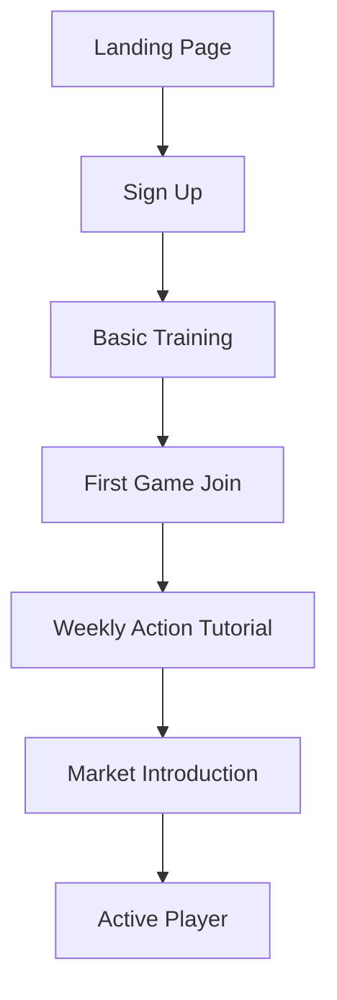
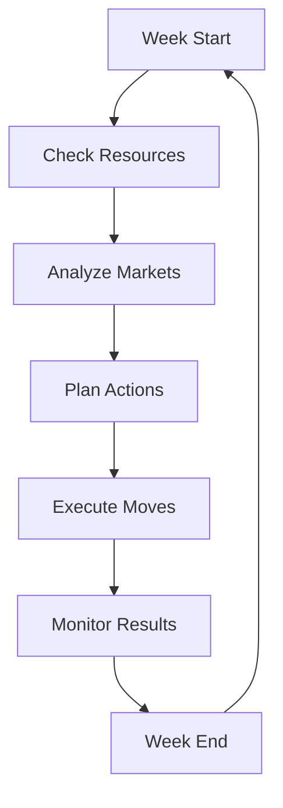
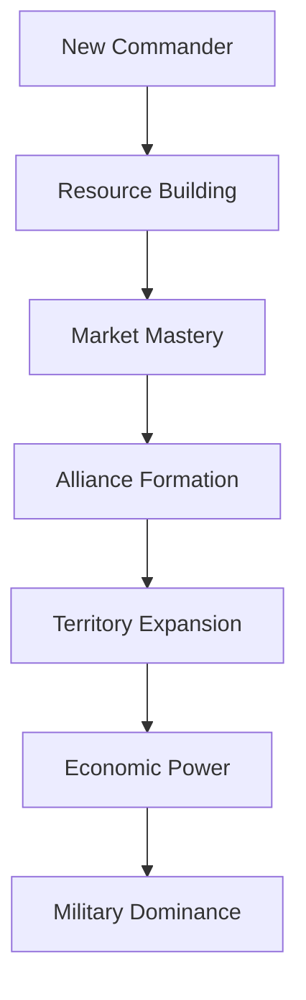

# Soldiers of Wealth - Product Design Document

## Core Premise & Value Proposition

Soldiers of Wealth is a strategic military-economic simulation game that combines resource management, market trading, and tactical warfare. The game addresses the need for:

1. **Strategic Depth**: Players must balance military might with economic prowess
2. **Social Interaction**: Multiplayer battles and alliances create dynamic gameplay
3. **Economic Education**: Real-world market mechanics in a gamified environment
4. **Long-term Engagement**: Weekly action cycles and progression systems

### Unique Selling Points
- Military strategy meets financial markets
- Dynamic economy with real-time market fluctuations
- Social gameplay with alliances and rivalries
- Weekly strategic decision-making

## User Roles & Personas

### 1. Commander (Standard Player)
**Profile:**
- Age: 25-40
- Interest in strategy games and financial markets
- Seeks competitive multiplayer experiences
- Values both tactical and economic gameplay

**Goals:**
- Build a powerful military force
- Make profitable market investments
- Form strategic alliances
- Climb the ranking ladder

### 2. Economic Strategist
**Profile:**
- Background in finance or economics
- Focuses on market analysis and trading
- Prefers indirect combat through market manipulation
- Values long-term strategic planning

**Goals:**
- Maximize investment returns
- Manipulate market conditions
- Build a diversified portfolio
- Achieve economic dominance

### 3. Military Tactician
**Profile:**
- Enjoys direct combat and territory control
- Focus on soldier management and battlefield tactics
- Values quick, decisive actions
- Competitive mindset

**Goals:**
- Expand territory control
- Build the largest army
- Execute successful attacks
- Achieve military dominance

### 4. Administrator
**Profile:**
- Game moderators and system managers
- Focus on fair play and game balance
- Monitors economic stability
- Manages player interactions

**Goals:**
- Maintain game balance
- Monitor for fair play
- Manage game economy
- Handle player requests

## Feature Breakdown

### Core Features (Free)
1. **Military Management**
   - Basic soldier recruitment
   - 3 weekly strategic moves
   - Defensive positioning
   - Basic training modules

2. **Economic System**
   - Market access (stocks, real estate, crypto, business)
   - Basic market analysis tools
   - Weekly soldier income
   - Resource management

3. **Social Features**
   - Basic forum access
   - Alliance formation
   - Game chat
   - Player profiles

4. **Gameplay Mechanics**
   - Weekly action cycles
   - Basic battlefield view
   - Market status updates
   - Progress tracking

### Premium Features (Paid)
1. **Advanced Military**
   - Enhanced training options
   - Special operations
   - Advanced defense systems
   - Elite units

2. **Economic Advantages**
   - Real-time market alerts
   - Advanced analytics
   - Priority trade execution
   - Market manipulation tools

3. **Social Enhancements**
   - Private messaging
   - Alliance leadership
   - Custom titles
   - Special forum access

4. **Quality of Life**
   - Action queue system
   - Enhanced UI themes
   - Priority game access
   - Detailed statistics

## User Journey Mapping

### 1. New Player Onboarding


### 2. Weekly Gameplay Loop


### 3. Long-term Progression


## Gameplay/Interaction Mechanics

### 1. Action System
- 3 weekly actions per player
- Actions can be used for:
  - Market investments
  - Military operations
  - Intelligence gathering
  - Territory control

### 2. Market System
- Four market types:
  - Stocks (High risk/reward)
  - Real Estate (Stable returns)
  - Cryptocurrency (Volatile)
  - Business (Long-term growth)
- Market conditions affect returns
- Economic cycles influence prices

### 3. Combat System
- Territory control mechanics
- Soldier deployment strategies
- Defense positioning
- Attack/counterattack mechanics

### 4. Alliance System
- Player cooperation
- Shared intelligence
- Joint operations
- Resource trading

## Progression Systems

### 1. Military Ranks
```
Recruit → Sergeant → Captain → Major → Colonel → General
```

### 2. Economic Status
- Investment levels
- Market influence
- Resource accumulation
- Territory control

### 3. Training System
- Combat training
- Economic education
- Intelligence operations
- Strategic planning

### 4. Achievement System
- Military victories
- Economic milestones
- Alliance leadership
- Territory control

## Monetization Strategy

### 1. Premium Subscriptions
- **Commander's Elite** ($9.99/month)
  - Additional weekly actions
  - Premium market tools
  - Enhanced training access
  - Custom titles

- **Strategic Command** ($19.99/month)
  - All Elite features
  - Market manipulation tools
  - Advanced analytics
  - Priority access

### 2. One-time Purchases
- Special training modules
- Custom UI themes
- Profile customization
- Title packages

### 3. Battle Passes
- Seasonal rewards
- Exclusive content
- Special missions
- Unique titles

## Success Metrics

### 1. Engagement KPIs
- Daily Active Users (DAU)
- Weekly Active Users (WAU)
- Average Session Duration
- Action Completion Rate
- Return Rate

### 2. Economic KPIs
- Premium Conversion Rate
- Average Revenue Per User (ARPU)
- Customer Lifetime Value (CLV)
- Churn Rate
- Transaction Volume

### 3. Social KPIs
- Alliance Formation Rate
- Forum Activity
- Player Interaction Rate
- Social Feature Usage

### 4. Game Balance KPIs
- Win/Loss Ratios
- Resource Distribution
- Market Stability
- Action Distribution

### 5. Technical KPIs
- Server Performance
- Error Rates
- Load Times
- API Response Times

## Implementation Priorities

### Phase 1: Core Systems
1. User authentication
2. Basic military mechanics
3. Market system foundation
4. Weekly action system

### Phase 2: Social Features
1. Alliance system
2. Forum implementation
3. Chat functionality
4. Player profiles

### Phase 3: Advanced Features
1. Premium features
2. Advanced analytics
3. Market manipulation tools
4. Enhanced training system

### Phase 4: Monetization
1. Subscription system
2. Battle pass implementation
3. Premium content
4. Payment processing
