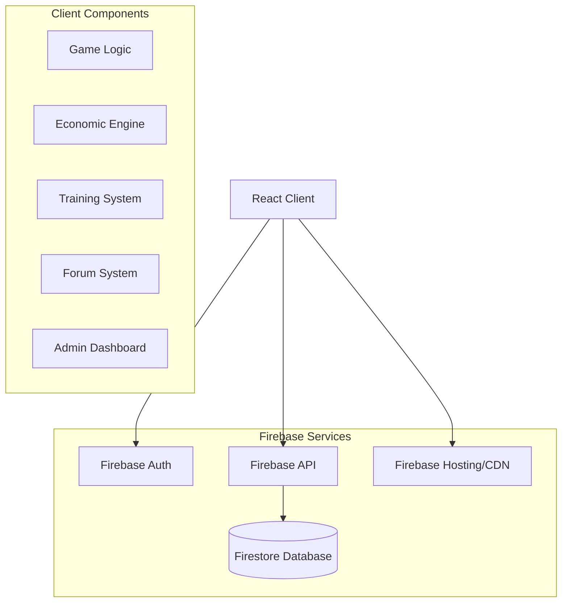
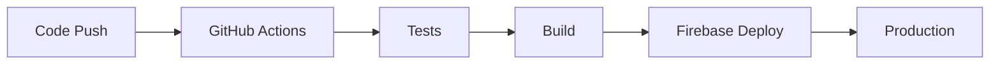

# System Architecture Document

## High-Level Architecture



### Core Components

1. **Frontend Application**
   - React-based SPA
   - Context-based state management
   - Route-based code splitting
   - Responsive design with Tailwind CSS

2. **Backend Services**
   - Firebase Authentication
   - Firestore Database
   - Firebase Hosting
   - Firebase Security Rules

3. **Game Systems**
   - Economic simulation engine
   - Player management
   - Combat system
   - Training modules
   - Forum integration

## Technology Stack

### Frontend
- **Framework**: React
- **State Management**: React Context API
- **Routing**: React Router v6
- **Styling**: 
  - Tailwind CSS
  - Styled Components
- **Icons**: React Icons
- **UI Components**:
  - Custom Modal
  - Toast notifications
  - Responsive navigation

### Backend
- **Platform**: Firebase
- **Services**:
  ```javascript
  // firebase.js
  const firebaseConfig = {
    apiKey: process.env.REACT_APP_FIREBASE_API_KEY,
    authDomain: process.env.REACT_APP_FIREBASE_AUTH_DOMAIN,
    projectId: process.env.REACT_APP_FIREBASE_PROJECT_ID,
    storageBucket: process.env.REACT_APP_FIREBASE_STORAGE_BUCKET,
    messagingSenderId: process.env.REACT_APP_FIREBASE_MESSAGING_SENDER_ID,
    appId: process.env.REACT_APP_FIREBASE_APP_ID,
    measurementId: process.env.REACT_APP_FIREBASE_MEASUREMENT_ID
  };
  ```

### Database
- **Type**: NoSQL (Firestore)
- **Collections**:
  - players
  - games
  - training_modules
  - forum_posts
  - economy

## API Design

### Authentication Endpoints
```javascript
// AuthContext.js
const authEndpoints = {
  signup: async (email, password) => {
    return createUserWithEmailAndPassword(auth, email, password);
  },
  login: async (email, password) => {
    return signInWithEmailAndPassword(auth, email, password);
  },
  googleAuth: async () => {
    const provider = new GoogleAuthProvider();
    return signInWithPopup(auth, provider);
  }
};
```

### Game API
```javascript
// Game operations
const gameOperations = {
  createGame: async (gameData) => {
    return addDoc(collection(db, 'games'), gameData);
  },
  updateGame: async (gameId, data) => {
    return updateDoc(doc(db, 'games', gameId), data);
  },
  deleteGame: async (gameId) => {
    return deleteDoc(doc(db, 'games', gameId));
  }
};
```

### Rate Limiting
- Implemented through Firebase quotas
- Custom rate limiting for specific operations:
  ```javascript
  const rateLimit = {
    actions: 3, // Actions per week
    requests: 100 // Requests per minute
  };
  ```

## Security Implementation

### Authentication
```javascript
// PrivateRoute.js
const PrivateRoute = ({ children }) => {
  const { currentUser } = useAuth();
  return currentUser ? children : <Navigate to="/login" />;
};
```

### Authorization
```javascript
// AdminRoute.js
const AdminRoute = ({ children }) => {
  const { isAdmin } = useAdmin();
  return isAdmin ? children : <Navigate to="/dashboard" />;
};
```

### Data Protection
```javascript
// Firestore Rules
service cloud.firestore {
  match /databases/{database}/documents {
    match /players/{userId} {
      allow read: if request.auth != null;
      allow write: if request.auth.uid == userId;
    }
    match /games/{gameId} {
      allow read: if request.auth != null;
      allow write: if request.auth != null && get(/databases/$(database)/documents/players/$(request.auth.uid)).data.isAdmin == true;
    }
  }
}
```

## Performance & Scalability

### Caching Strategy
```javascript
// Data caching implementation
const cacheConfig = {
  training: {
    maxAge: 3600, // 1 hour
    strategy: 'stale-while-revalidate'
  },
  gameData: {
    maxAge: 300, // 5 minutes
    strategy: 'network-first'
  }
};
```

### Load Balancing
- Firebase automatic scaling
- Regional deployment
- Edge functions for global distribution

### Database Optimization
```javascript
// Firestore indexes
{
  "indexes": [
    {
      "collectionGroup": "games",
      "queryScope": "COLLECTION",
      "fields": [
        { "fieldPath": "status", "order": "ASCENDING" },
        { "fieldPath": "startDate", "order": "ASCENDING" }
      ]
    }
  ]
}
```

## DevOps & Deployment

### CI/CD Pipeline


### Environments
1. **Development**
   - Local environment
   - Firebase Emulators
   - Hot reloading

2. **Staging**
   - Firebase project: staging
   - Automated deployments
   - Integration testing

3. **Production**
   - Firebase project: production
   - Manual approval
   - Monitoring enabled

### Monitoring
```javascript
// Error tracking
const monitoring = {
  errors: {
    capture: (error) => {
      console.error(error);
      // Send to monitoring service
    },
    report: (data) => {
      // Report to analytics
    }
  }
};
```

## Error Handling & Logging

### Error Management
```javascript
// Global error handler
const errorHandler = {
  handleError: async (error) => {
    if (error.code === 'auth/user-not-found') {
      return { type: 'AUTH_ERROR', message: 'User not found' };
    }
    if (error.code === 'permission-denied') {
      return { type: 'PERMISSION_ERROR', message: 'Access denied' };
    }
    return { type: 'UNKNOWN_ERROR', message: error.message };
  }
};
```

### Logging System
```javascript
// Logging levels
const logger = {
  error: (message, error) => {
    console.error(message, error);
    // Send to logging service
  },
  warn: (message) => {
    console.warn(message);
    // Log warning
  },
  info: (message) => {
    console.info(message);
    // Log info
  }
};
```

## Future Scalability

### Planned Enhancements
1. **Microservices Architecture**
   ```mermaid
   graph TD
       A[API Gateway] --> B[Game Service]
       A --> C[Economy Service]
       A --> D[Training Service]
       A --> E[Forum Service]
   ```

2. **Data Sharding**
   ```javascript
   const shardConfig = {
     games: {
       shardKey: 'region',
       shardCount: 10
     },
     players: {
       shardKey: 'gameId',
       shardCount: 5
     }
   };
   ```

3. **Caching Layer**
   - Redis implementation
   - Distributed caching
   - Cache invalidation strategy

4. **Load Testing**
   ```javascript
   const loadTest = {
     concurrent_users: 1000,
     requests_per_second: 100,
     test_duration: '1h'
   };
   ```

### Scalability Metrics
- Current user capacity: 10,000
- Target user capacity: 100,000
- Response time: < 200ms
- Availability: 99.9%

### Infrastructure Scaling
1. **Database**
   - Horizontal partitioning
   - Read replicas
   - Automated backups

2. **Compute**
   - Auto-scaling
   - Regional distribution
   - Edge computing

3. **Storage**
   - CDN optimization
   - Asset compression
   - Lazy loading
